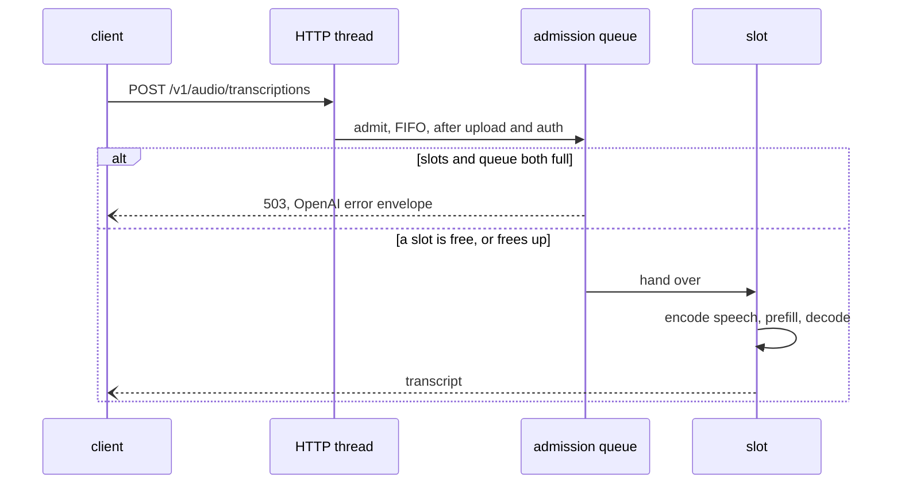
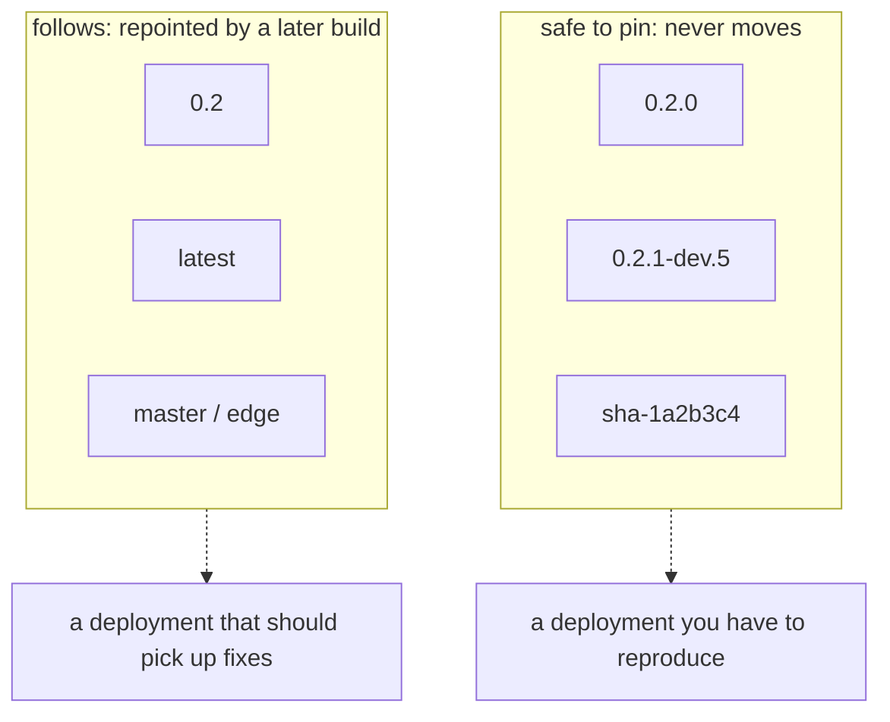
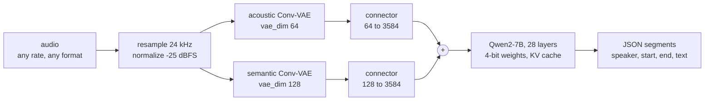

<p align="center">
  
</p>

<p align="center">
  <a href="https://github.com/Ar4ikov/vibevoice.c/actions/workflows/container.yml"></a>
  <a href="https://github.com/Ar4ikov/vibevoice.c/releases/latest"></a>
  <a href="https://github.com/Ar4ikov/vibevoice.c/pkgs/container/vibevoice.c"></a>
  
  
  
  <a href="LICENSES"></a>
</p>


A runtime for Microsoft's **VibeVoice-ASR** written in C and CUDA, with no
Python, PyTorch, ONNX Runtime or cuBLAS anywhere in the inference path. One
binary transcribes audio with speaker diarization and timestamps, serves an
OpenAI-compatible HTTP endpoint, or listens to a microphone.

Output is **identical, character for character, to the PyTorch reference**
running the same checkpoint — verified on 11 s, 120 s and 32-minute inputs by
diffing every intermediate tensor against a `transformers` + `bitsandbytes`
dump (`tools/compare_ref.py`).

```
$ vv_cli --model ./model_hf --audio meeting.wav --output transcript.json
[  0.00 -  11.11] Speaker 0  And so, my fellow Americans, ask not what your
                             country can do for you, ask what you can do for
                             your country.
[ 11.73 -  22.29] Speaker 1  He hoped there would be stew for dinner, turnips
                             and carrots and bruised potatoes...
RTF 0.065  (120 s of audio in 7.8 s)
```

---

## Why this exists

VibeVoice-ASR is a Qwen2-7B decoder fed by two Conv-VAE speech tokenizers.
Running it normally means a Python stack, a PyTorch install, and 4-bit
weights unpacked through bitsandbytes. This is the same model with the same
outputs, as a single file you can drop on a machine and run.

**No CUDA toolkit on the target.** The CUDA runtime is linked statically and
cuBLAS is not used at all — both GEMM shapes are hand-written WMMA kernels,
which measured slightly *faster* than cuBLAS here. The release binary is
10.7 MB and links against nothing but `libc` and `libm`:

```
$ ldd vv_cli
    linux-vdso.so.1
    libm.so.6 => /lib/x86_64-linux-gnu/libm.so.6
    libc.so.6 => /lib/x86_64-linux-gnu/libc.so.6
```

It carries cubins for Turing, Ampere, Ada and Hopper plus PTX for anything
newer, and the driver is loaded lazily — so the same binary also starts on a
machine with no NVIDIA driver at all and falls back to the CPU kernels.

---

## Performance

RTX 3090, CUDA 12.4, Ryzen 9 5900X. Defaults unless noted.

| | |
|---|---|
| Model load | **9.5 s** |
| Speech encoding | **243 ms** per 11 s of audio |
| Prefill | **3056 tok/s** on a 14449-token prompt |
| Decode | **128 tok/s** at 0.2K context, 112 at 1.5K, 76 averaged over a 14K-to-24K window |
| RTF | **0.065** on a 120 s file, **0.079** on 32 minutes |
| VRAM | 9.8 GB (3.2 GB weights + 1.8 GB KV at a 32K window) |

`transformers` + `bitsandbytes` on the same GPU and checkpoint: 27.6 tok/s.

A 32-minute recording transcribes in 152 s: 14449 prompt tokens, 9522
generated, 168 segments, flat memory throughout.

### CPU only

No GPU, or `--cpu`. Runtime-selected AVX2 on x86 and NEON on ARM, threads
defaulted to physical cores.

| | |
|---|---|
| Prefill | **77 tok/s**, 991 GFLOP/s across the quantized GEMMs |
| Decode | **7.9 tok/s** (12 cores, AVX2) |
| RTF | **0.81** on a 30 s file |

Output is identical to the GPU path.

Prefill is a packed GEMM: both operands are copied into k-major panels and a
6x16 register tile accumulates over the k-block, with the panels sized so the
activation block sits in L2 and the dequantized weights in L1. That is 3.5x
the row-at-a-time kernel it replaced and 65% of this machine's measured FMA
peak. Decode is a different problem — one token reads all 3.2 GB of packed
weights, so 7.9 tok/s is 26 GB/s against about 30 GB/s of usable
dual-channel DDR4, and there is no headroom there worth chasing.

Threads default to physical cores and are pinned to them. Hyperthreads are
deliberately unused: these kernels are bandwidth bound and a second thread
per core takes decode from 7.9 to 4.3 tok/s. Pinning matters for the same
reason and is easy to miss, because without it the OS puts two workers on one
core's siblings often enough that the same prefill measured 650 and 1120
GFLOP/s on consecutive runs. `OMP_NUM_THREADS` still sets the count, any of
the OpenMP affinity variables take over placement, and `VV_CPU_BIND=0` turns
pinning off.

---

## What it does

### Transcription

```bash
vv_cli --model ./model_hf --audio recording.wav --output transcript.json
vv_cli --model ./model_hf --audio meeting.m4a --hotwords "Kubernetes,Grafana"
```

WAV is parsed directly; anything else goes through `ffmpeg` if it is on PATH.
Audio longer than 60 s is encoded in streaming segments with convolution
caches, so the result is bit-identical to processing the whole signal at once
and memory stays flat.

Output is deterministic: the same file gives the same transcript every time.
`--acoustic-sampling gaussian --seed N` swaps that for the reference's draw of
the acoustic latent, seeded so it stays repeatable — see below.

### HTTP server

```bash
vv_cli serve --model ./model_hf --port 8080 --slots 2 --kv-cache tq4
```

OpenAI-compatible, which is also the contract GPUStack's speech-to-text
backend expects:

| endpoint | |
|---|---|
| `POST /v1/audio/transcriptions` | multipart `file`, plus optional `model`, `prompt` (used as hotwords), `temperature`, `response_format` |
| `POST /v1/audio/translations` | same handler; this model outputs English |
| `GET /v1/models`, `GET /v1/models/{id}` | the loaded model |
| `GET /health`, `/healthz`, `/v1/health` | liveness, slot count, completed requests |
| `GET /metrics` | Prometheus counters |

`response_format` accepts `json`, `verbose_json` (segments with timings and
speaker), `text`, `srt` and `vtt`.

```bash
curl http://localhost:8080/v1/audio/transcriptions \
     -F file=@meeting.mp3 -F response_format=verbose_json
```

`--slots N` runs N requests concurrently against **one** copy of the weights;
each slot costs only its own KV cache and workspace. Two 30-second files
finish in 4.2 s together against 5.8 s back to back, returning identical
transcripts either way. Not 2×, because decode
is bandwidth-bound on the weights and interleaves — everything either side of
it overlaps. With `--kv-cache tq4 --max-seq-len 8192` a slot is 115 MB.



### Live microphone

```bash
vv_cli devices                                          # what can record
vv_cli mic --model ./model_hf --timestamps
vv_cli mic --model ./model_hf --device 1                # index, name, or part of one
vv_cli mic --model ./model_hf --from-file meeting.wav   # replayed in real time
```

Captures continuously and transcribes each utterance as it ends, segmenting
on an energy VAD with hysteresis, pre-roll and hangover. Capture is ALSA
(loaded with `dlopen`, so the binary still runs without it), falling back to
an external recorder on a pipe — `arecord` on Linux, ffmpeg's `dshow` on
Windows, `avfoundation` on macOS.

`vv_cli devices` lists what the active backend can open, and `--device` takes
an index from that list, a device name, or any fragment of one. dshow has no
device called "default", so on Windows the first device is resolved by name
before ffmpeg is started; what actually gets passed is the alternative name
(`@device_cm_{...}`), which stays unambiguous when two endpoints share a
label — a combined headset, or two identical ones on the same machine.

`--from-file` replays a WAV at wall-clock speed through the identical path,
which is how the streaming path is tested without a sound card.

### Chat

```bash
vv_cli chat --model ./model_hf
> meeting.wav
> rec 5
> hotwords Kubernetes,Grafana
```

The model loads once and stays warm. Ten seconds of startup per file is
absurd for short clips; this pays it once.

---

## Quantization

### Weights

| format | how |
|---|---|
| **NF4** (bitsandbytes, double-quantized) | loaded directly |
| **AWQ** (AutoAWQ) | loaded directly |
| **GPTQ** (AutoGPTQ / GPTQModel) | loaded directly; `gptq_v2` zero points recognised; act-order (`desc_act`) refused |
| **BF16 / F16 / F32** (unquantized) | dense FP16, or `--quant nf4\|int4\|int8` at load |

What a projection is gets decided by what the file holds — U8 with an
`.absmax` next to it is NF4, an I32 `qweight` is AWQ/GPTQ, anything float is
dense — and every tensor is checked against the config's shape; a missing or
misshaped one fails the load with its name. `--quant auto` (the default)
keeps the checkpoint as it is; `none`, `nf4`, `int4` and `int8` apply to
dense checkpoints and quantize each projection as it is read from the
mapping, before placement, so the VRAM budget sees the final sizes and peak
host memory is the quantized model plus a few rows per thread. NF4 here is
bitsandbytes' layout (blocks of 64, FP16 scales, no double quantization);
INT4 is the asymmetric group-128 layout the AWQ path uses; INT8 is
per-output-channel symmetric (one FP32 scale per row, the layout the W8A8
work builds on) with its own GEMV. All three are deterministic whatever the
thread count.

`microsoft/VibeVoice-ASR` (BF16, 17.3 GB) on a 3090:

| `--quant` | load (warm) | VRAM | decode | RTF 11 s / 30 s / 120 s | transcript vs the NF4 checkpoint |
|---|---|---|---|---|---|
| `none` (FP16) | 4.7 s | 18.7 GB | 56 tok/s | 0.108 / 0.110 / 0.109 | same words on all three |
| `nf4` | 5.4 s | 9.8 GB | 127 tok/s | 0.066 / 0.061 / 0.059 | same words; jfk and test30 byte-identical |
| `int4` | 2.7 s | 9.7 GB | 133 tok/s | 0.064 / 0.060 / 0.057 | same words |
| `int8` | 3.6 s | 12.5 GB | 97 tok/s | 0.077 / 0.073 / 0.071 | same words |

Load is the best of three with the page cache warm, on the 12 physical
cores; quantizing is cheaper than uploading the 14 GB the dense model
needs, so `int4` loads faster than `none`.

Where they differ it is in timestamps (at most 0.06 s, 0.44 s once for
`int4`) and in one speaker label: on test30, whose middle clip is a
different voice, dense BF16, `int4` and `int8` call it Speaker 1 while the NF4
checkpoint calls everything Speaker 0.

AWQ packs the eight columns of a word along `N` (`qweight [K, N/8]`), GPTQ
the eight rows along `K` (`qweight [K/8, N]`); the loader tells them apart by
shape. Either is the wrong orientation for a GEMV, so both are repacked once
at load into a row-major `[N][K/2]` layout with the exact integer zero point
kept per group. The CPU kernels read that. The GPU path goes one step
further before anything is uploaded (so there is only ever one copy): inside
every 16-byte run of a row the nibbles are permuted so a single `LOP3` with
the `0x6400` half-precision magic yields four `half2` weights that are at
once the GEMV's natural `x` pairs and the tensor-core `m16n8k16` B fragment,
and scale and zero point sit together as one `half2` per group.
Dequantization is `(q − z)·s` in FP16 — the reference's own formula; the
older path's `q·s + fp16(−z·s)` differed in the last bit.

- **Decode GEMV**: 128-bit loads, 16–128 lanes per row (more when `N` is
  small, so the 512-row k/v projections still cover all 82 SMs), two rows
  per lane group when `K` is long, HFMA2 chains of four flushed to FP32.
  On a 3090 (graph-replayed, weights cycled past L2): gate/up 849 GB/s,
  down 825, q/o 691, k/v 294 — against 727 / 669 / 597 / 208 before. The
  two small shapes are launch-latency bound (6.4 MB and 0.9 MB).
- **M > 1**: a Marlin-style tensor-core GEMM keeps the weights 4-bit through
  `cp.async` into shared memory and dequantizes in registers straight into
  the B fragments, 16/32/64/128-row tiles and split-K when the grid would
  not cover the card. No 136 MB FP16 copy of each weight any more: 9–16
  rows are 14–25× faster than before, 64 rows 3–9×, a 2048-token prefill
  chunk 1.0–1.8× (60 TFLOP/s on gate/up/down). Turing falls back to
  dequantize + dense GEMM (`VV_W4A16_MMA=0` forces that path).
- GPTQ act-order checkpoints scatter each group over the input channels;
  running them would need the activations permuted per projection, so the
  loader refuses them instead of producing wrong weights as it used to.
- `VV_INT4G_LEGACY=1` keeps the old layout and kernels, for comparison.

On the same audio AWQ gives an identical transcript, 145 against NF4's
125 tok/s of decode at short context (124 vs 110 at 1.5K, 81 vs 75 on a
32-minute file) and 2.3× NF4's prefill rate on an 11 s clip, for 3% more
VRAM — NF4's own scales are double-quantized, so it is already at 4.13
bits against AWQ's 4.16.

[`Ar4ikov/VibeVoice-ASR-AWQ-W4A16-ASYM`](https://huggingface.co/Ar4ikov/VibeVoice-ASR-AWQ-W4A16-ASYM)
is a real activation-aware build: `llm-compressor`'s `AWQModifier` over 256
calibration samples (64 audio, 192 text), group 128, asymmetric, exported into
the AWQ GEMM container this runtime reads. 7.0 GB against the BF16 original's
17.3 GB. On nine held-out LibriSpeech clips it scores 14 word errors out of
135 against the BF16 baseline's 16, and the C runtime reproduces the PyTorch
AWQ answer on all nine — a smoke test, not a benchmark.

`tools/convert_awq.py` re-quantizes an NF4 checkpoint into the same container
if you would rather not download a second set of weights. It does not do the
activation-aware scale search, so it is the weaker of the two; the runtime
treats both identically.

### KV cache

The KV cache is the only allocation that grows with audio length, so it is
what decides how long a recording fits. `--kv-cache` picks the format:

| `--kv-cache` | at 32K positions | 120 s transcript | decode, 0.2K ctx |
|---|---|---|---|
| `fp16` (default) | 1792 MB | reference | 105 tok/s |
| `fp8` (E4M3) | 896 MB | **identical** | 100 |
| `fp8-e5m2` | 896 MB | **identical** | 98 |
| `tq4` | 462 MB | **identical** | 90 |
| `tq3` | 350 MB | 94% similar | 87 |
| `tq2` | 238 MB | degraded | 89 |
| `tq1.5` | 182 MB | degraded | 87 |

FP8 is emulated in software — encode and decode are a handful of shifts — so
it works on Ampere and would work on Apple Silicon, neither of which has FP8
hardware. The point is halving memory, not using an FP8 MAC.

`tq*` is **TurboQuant** (Zandieh et al., 2025): each 128-dim vector goes
through a randomized Hadamard transform, which spreads the outlier channels
that make raw K hard to quantize, and the result is quantized with the
MSE-optimal Lloyd-Max levels for a Gaussian. The transform is orthogonal, so
attention never inverts it per key — Q is rotated once before the kernel and
the output un-rotated after, and the kernels read stored values directly.

The part that took measuring to find: **quantizing K as it comes destroys the
output at every rate**, including FP8 (attention cosine 0.86). Qwen2's keys
share a large common component — ‖k‖ is 273 against ‖k − mean‖ of 11 — so the
quantizer spends its whole range representing a constant. Softmax is
invariant to a constant shift of every key, so the cache stores K relative to
a per-layer reference vector built from the first prefill chunk. That single
change takes FP8 from 0.856 to 0.9995 and TQ4 from 0.673 to 0.995.

At long context the sub-byte formats cost throughput: on the 32-minute file,
`fp16` decodes at 56.7 tok/s and `tq4` at 30.4, because unpacking bits with
warp shuffles is work the FP16 path does not do. `tq4` wins prefill for the
same reason it loses decode — there is a quarter as much cache to read.

---

## Fitting on a smaller card

`--gpu-layers N` keeps N transformer layers resident and streams the rest
from host RAM per token; `-1` (the default) fits as many as the VRAM budget
allows. The copy for layer *i+1* overlaps the compute of layer *i* through
CUDA events, and the host copies are page-locked so the driver DMAs straight
out of them.

Measured on a PCIe 4.0 x16 link, transcript identical at every setting:

| `--gpu-layers` | decode |
|---|---|
| 28 (all resident) | 124 tok/s |
| 25 | 75.2 |
| 20 | 23.5 |
| 14 | 12.9 |
| 0 (everything streamed) | 6.6 |

Streaming is bandwidth-bound and nothing can change that: with every layer
streamed, 3.3 GB moves per token at 21.8 GB/s, which is the link saturated.
Halving the link halves the number — on a x4 slot the same 20/28 setting
gives 6.1 tok/s instead of 23.5. Use it to make a model fit, not to make it
fast.

Other knobs for tight memory: `--max-seq-len` bounds the KV window,
`--gpu-memory` caps what the process may take (below), `--cpu` forces the
CPU path.

---

## Several cards

`--gpus` picks the devices and `--gpu-memory` says how much of each may be
spent:

```bash
vv_cli serve --model ./model_hf --gpus 0,1 --slots 4      # one replica each
vv_cli serve --model ./model_hf --gpus all --gpu-memory 80%
vv_cli --model ./model_hf --audio a.wav --gpus 0,1        # one model, split
vv_cli --model ./model_hf --audio a.wav --gpus 1 --gpu-memory 18GiB
```

A size is a percentage or an absolute with the usual suffixes — `80%`,
`18GiB`, `8G`, `8192M`, or a plain byte count — and `GB` means 1024s like
`GiB` does, because a card sold as 24 GB has 24 GiB and reading it the other
way would quietly hand back 2% less than asked for. One value caps every
device; a comma-separated list caps them one by one, in the order `--gpus`
gave, and a list whose length does not match is refused rather than padded.

The cap is honoured by the placement decision rather than checked afterwards,
so a device whose budget cannot hold every layer falls back to streaming
exactly as `--gpu-layers` does. It covers everything the process puts on that
card: the CUDA context, the 1.3 GB of speech-encoder weights, the encoder's
scratch, the KV cache and the workspace, not just the transformer. On a 3090,
`--gpu-memory 6GiB` peaks at 4.5 GB with seven layers resident and a 8192-token
window; without the flag the same run holds all 28 and a 32768-token window.

### Replicas, or one model split

There are two ways to use several cards and they are not alternatives.

**Replicas** put a full copy of the model on each device with its own slots.
Nothing crosses between them, so this is the shape that multiplies
throughput. Eight 30-second clips, four slots, two 3090s:

| | 8 requests |
|---|---|
| `--gpus 0 --slots 4` | 13.2 s |
| `--gpus 0,1 --slots 4` | **7.6 s** |

1.75x rather than 2x because the per-request work that is not on the GPU —
audio decode, prompt building, JSON — is shared.

**Layer sharding** splits one model: layers 0..k on the first device, the
rest on the next, each owning the KV cache for its own layers. The devices
take turns rather than working at once, so it buys capacity, not speed —
what crosses a boundary is one hidden state, 3584 halves, against the ~8 ms
of compute that token costs. On two 3090s a 30-second file measures 124.7
tok/s decode and RTF 0.059 sharded against 122.0 and 0.060 on one card.

Capacity is the point. Give each card a 6 GiB budget:

| | resident | decode | RTF |
|---|---|---|---|
| `--gpus 1 --gpu-memory 6GiB` | 7/28 layers | 8.7 tok/s | 0.595 |
| `--gpus 0,1 --gpu-memory 6GiB` | **28/28** | **122.9 tok/s** | **0.059** |

Two cards that each hold a quarter of the model hold all of it between them,
and the streaming that made the first case slow stops entirely.

The split is proportional to what each device can give to layers, not even:
the primary also carries the embedding table, the head and the speech
encoder, which is 3.4 GB before a layer lands, so it gets fewer. At 6 GiB
each that is 7 layers on the first card and 21 on the second.

`--split-mode` picks:

```
auto      replicate while there is a slot for every device, shard otherwise
replica   a full copy on each device
layer     one model, its layers spread over them
```

`auto` is the default. A single file is one request and cannot be in two
places at once, so `vv_cli --audio` with several devices shards; `serve
--slots 4` on two devices replicates; `serve --slots 1` on two devices
shards, because the second replica would only sit idle.

---

## Container images

```bash
docker run --rm --gpus all -p 8080:8080 -v /models:/model:ro   ghcr.io/ar4ikov/vibevoice.c:0.2 serve --model /model --host 0.0.0.0
```

Versions follow [SemVer 2.0](https://semver.org), and every published image
has one version tag that never moves — pin that one:

| tag | published by | moves |
|---|---|---|
| `0.2.0` | the `v0.2.0` release | never |
| `0.2.1-dev.5` | a push to master (5 commits past v0.2.0) | never |
| `sha-1a2b3c4` | any push | never |
| `0.2` | the newest `0.2.x` release | to the next patch |
| `latest` | the newest release | to the next release, never a dev build |
| `master`, `edge` | a push to master | with the branch |
| `pr-7` | a pull request | built and checked, never pushed |



The version is compiled into the binary, so it can be asked rather than
trusted — `--version`, `GET /health` and the `vibevoice_build_info` metric
all report it, and CI refuses to announce an image that does not report
exactly the version it is tagged with:

```bash
$ docker run --rm ghcr.io/ar4ikov/vibevoice.c:0.2.0 --version
vibevoice.c 0.2.0 (1a2b3c4) [cuda openmp]
```

Each GitHub release also carries the same binary as
`vibevoice.c-<version>-linux-x86_64.tar.gz`, with its SHA-256.

Tagging, what each tag guarantees, and how to cut a release:
[docs/RELEASING.md](docs/RELEASING.md). GPUStack deployment:
[deploy/gpustack/](deploy/gpustack/README.md).

---

## Building

### Linux (CUDA)

```bash
export PATH=/usr/local/cuda-12.4/bin:$PATH
cmake -B build -DCMAKE_BUILD_TYPE=Release -DVV_ENABLE_TRT=OFF \
      -DCMAKE_CUDA_ARCHITECTURES=86
cmake --build build -j
```

For the shipping binary — all architectures, static runtimes, no tests:

```bash
scripts/build-release.sh
```

### Windows

```powershell
scripts\build-release.ps1
```

or `build.ps1` / `build.bat` for a development build. Requires MSVC 2022 and
a CUDA toolkit to *build*; the resulting `.exe` needs neither on the machine
that runs it.

### macOS

```bash
brew install libomp        # optional, but without it the kernels are serial
scripts/build-macos.sh
```

This is the CPU build: NEON on Apple Silicon, AVX2 on Intel Macs, threads on
the performance cores. **There is no Metal backend.** See "Not done" below.

### Tests

```bash
VV_TEST_MODEL=./model_hf ctest --test-dir build --output-on-failure
```

Eighteen suites. The ones that need weights report SKIP without
`VV_TEST_MODEL`. `test_cpu_kernels` checks every CPU kernel against a scalar
reference, which is what makes the SIMD paths verifiable per architecture —
it passes natively on AVX2 and under `qemu-aarch64` on NEON, both to 4e-7
relative.

---

## Getting the model

| what | where |
|---|---|
| BF16 original (dense, or `--quant nf4\|int4`) | [`microsoft/VibeVoice-ASR`](https://huggingface.co/microsoft/VibeVoice-ASR) |
| NF4 weights (bitsandbytes) | [`scerz/VibeVoice-ASR-4bit`](https://huggingface.co/scerz/VibeVoice-ASR-4bit) |
| AWQ weights (W4A16, asymmetric) | [`Ar4ikov/VibeVoice-ASR-AWQ-W4A16-ASYM`](https://huggingface.co/Ar4ikov/VibeVoice-ASR-AWQ-W4A16-ASYM) |
| `tokenizer.json` | [`microsoft/VibeVoice-ASR`](https://huggingface.co/microsoft/VibeVoice-ASR) or Qwen2.5-7B |

Any of them works; point `--model` at the directory. The NF4 and BF16 repos
do not ship tokenizer files, so drop `tokenizer.json` next to the
safetensors. The AWQ repo already carries its own.

The loader also recognises `microsoft/VibeVoice-ASR-BitNet` (1.5B, tied head)
and `microsoft/VibeVoice-ASR-Streaming-7B` by their configs. The streaming
model generates chunk by chunk on a persistent KV cache, which a one-shot
`vv_cli` run refuses for now; its prompt, stop tokens and chunk geometry are
in place in `src/inference/family.c`.

---

## How it works



No mel spectrogram, no FFT. Raw 24 kHz PCM goes straight into two Conv-VAE
tokenizers, each compressing 3200× (ratios 8·5·5·4·2·2) down to 7.5 Hz. The
two latent streams are projected to the LLM's 3584 dims and added.

### The acoustic latent is a distribution

The acoustic tokenizer does not return a latent, it returns the mean of a
Gaussian. Which draw the reference takes is in the checkpoint
(`std_dist_type`), and for this one it is `gaussian`: a single scale
`s ~ N(0, fix_std/0.8)` for the whole clip, then `mean + s·N(0,1)` per element.
`s` is drawn per run, is as often negative as positive, and has RMS 0.625.

The default here is the mode — the mean itself, which is reproducible and is
the most likely latent rather than one draw from around it. `--acoustic-sampling
gaussian --seed N` takes the reference's draw instead, and `fix` takes the
simpler `mean + fix_std·N(0,1)`. The seed pins it: same seed, same latent, same
transcript. It cannot be bit-identical to PyTorch, because a different
generator gives different numbers from the same seed; what it answers is
whether the transcript survives noise of that size.

On a clean 30 s clip, eight draws with scales from −0.47 to +0.85 all gave a
transcript identical to the mode. On an 11 s clip of slurred, noisy Russian,
four of eight draws changed a word — `ложи` against `ложе`, the ending of
`Долбоёб...` — which is where the audio is genuinely ambiguous and the noise
decides the coin flip. That is the honest reason the mean was never a problem.

The kernels that matter:

- **`gemm.cu`** — both GEMM shapes on tensor cores via WMMA, 128×128×32 block
  tiles over 8 warps, double-buffered shared memory. Replaces cuBLAS.
- **`nf4_gemv.cu`** / **`awq_gemv.cu`** — dequantization fused into the MAC.
  The generic path (expand to FP16 scratch, then GEMM) moves 5× the bytes;
  single-token decode is purely bandwidth bound, so the weights stay 4-bit
  all the way into the multiply.
- **`w4a16.cu`** — AWQ/GPTQ on the GPU: the decode GEMV and a Marlin-style
  tensor-core GEMM over one shared weight layout, int4 kept packed through
  shared memory and dequantized in registers with `LOP3`.
- **`attention.cu`**, **`attention_mma.cuh`** — FlashAttention-2 prefill with
  both matmuls on tensor cores, and a split-KV flash decode where each warp
  owns a slice of the cache and a second kernel merges the partial softmax
  states. The prefill kernel issues `mma.sync` as PTX rather than through the
  WMMA API, because the online softmax has to rescale the output accumulator
  per row and only `mma.sync` documents which row each accumulator register
  holds. That layout pays twice: the A operand of the next matmul is laid out
  exactly like the accumulator of the previous one, so the softmax
  probabilities feed P·V from the registers they were computed in.
- **`kv_quant.cu`** — the FP8 and TurboQuant stores, plus attention kernels
  that read them. Sub-byte codes are laid out so lane L owns dims 4L..4L+3,
  putting its bits in a contiguous run the warp fetches with one coalesced
  load and a shuffle.
- **`lm_head.cu`** — the 152k-row head fused with a two-stage on-device
  argmax, so 4 bytes cross the bus per token instead of 600 KB.

Four bugs found by diffing against the reference, each of which alone turned
the output into repetitive noise, are written up in `CLAUDE.md` §0 — byte-level
BPE, the causal `SConv1d` padding formula, exact GELU versus SiLU, and warps
of one block reaching different numbers of `__syncthreads()` in flash
attention.

### Prefill attention

Both matmuls in attention are O(S²) and the first version of the kernel ran
them as scalar FP32 FMAs, one warp per query row. On a 3090, causal
self-attention with 28 heads at head_dim 128:

| sequence | scalar | tensor cores |
|---|---|---|
| 1024 | 4.58 ms (1.6 TFLOP/s) | **0.18 ms (42.1 TFLOP/s)** |
| 4096 | 72.1 ms (1.7 TFLOP/s) | **2.10 ms (57.3 TFLOP/s)** |
| 8192 | 288.2 ms (1.7 TFLOP/s) | **8.03 ms (59.9 TFLOP/s)** |

59.9 TFLOP/s is 84% of the card's 71 TFLOP/s ceiling for FP16 multiply with
FP32 accumulate. An RTX 3070 reaches 31.8 of its own 40.7, the same 35× over
the scalar kernel.

End to end on the 32-minute file, prefill goes from 30.7 s to 4.7 s
(471 → 3056 tok/s) and the whole transcription from 182 s to 155 s.

The text is identical. Four of the 336 timestamps the model emits move by
10 ms, which is FP16 rounding inside the P·V product landing on the other side
of a digit, and is inside the ±100 ms the timestamps are held to.

`VV_ATTN_MMA=0` forces the scalar kernel, which is also what `ctest` runs the
attention suite a second time under: both have to agree with an FP64 reference
across fourteen shapes, on and off every tile boundary, with and without the
chunked-prefill offset.

### The decode step is one submission

A token is about 450 kernels through 28 layers, and consecutive kernels on a
stream cannot overlap, so each pays a dispatch gap whether or not the host can
keep up — measured here at 304 µs of an 8 ms token, which is what capturing the
step and replaying it recovers.

Replaying needs the step to be a function of device state, because a replay
reuses the kernel arguments its capture recorded. The three things that move
with the position now read a device int instead: the RoPE angle, where the new
K and V land, and how far attention walks. The one thing that cannot move into
device memory is the launch grid, and the decode attention's split count steps
up every 1024 cached positions — so the capture is redone when it does, about
two dozen times across a 24K decode against thousands of replays.

| | direct launches | replayed |
|---|---|---|
| 0.2K context, fp16 KV | 122.9 tok/s | **127.7** |
| 1.5K context, fp16 KV | 107.4 tok/s | **111.6** |
| 0.2K context, tq4 KV | 117.5 tok/s | **122.2** |
| 1.5K context, tq4 KV | 96.7 tok/s | **100.2** |
| the 32-minute file | 73.4 tok/s, 156.7 s | **75.6 tok/s, 152.4 s** |

Transcripts are byte-identical either way, that last one included.
`VV_CUDA_GRAPH=0` turns it off, which is also automatic when weights are
streamed (a streaming pool patches host pointers between layers, and no graph
can record that).

Getting this right needed one other thing. Anything issued to CUDA's legacy
default stream synchronises with every blocking stream in the process, so a
four-byte read-back in one request used to stall every other slot — and knock
any capture in flight out of capture mode, which discards that token's work
and returned a transcript of one garbage token. Nothing in the pipeline, the
speech encoder or the connectors touches the default stream any more.

---

## Not done

- **Metal.** macOS runs on the CPU path. A Metal backend was not written
  because it can be neither compiled nor run from the machine this was
  developed on, and a few thousand lines of untested shaders would be a
  claim that cannot be stood behind. The seam exists:
  `include/vibevoice/device.h` declares the op set, a build links exactly one
  implementation of it, and `src/device/device_none.c` shows the shape.
- **`src/trt/`** is stubs. The CUDA encoder does 11 s of audio in 243 ms, so
  TensorRT may never be worth it.

---

## Layout

```
include/vibevoice/   public headers; device.h is the accelerator op set
src/core/            allocator, logger, clock, threading shim
src/audio/           WAV, resample, normalize, ffmpeg bridge, mic, VAD
src/text_tokenizer/  byte-level BPE
src/tokenizer_encoder/  Conv-VAE speech tokenizers
src/model/           safetensors, config, weight loading and repacking
src/quant/           NF4 tables, AWQ repack, KV format registry
src/cpu/             CPU kernels (AVX2 / NEON / scalar)
src/cuda/            CUDA kernels
src/device/          the no-accelerator stub
src/inference/       pipeline, decoder, KV cache, sampling, post-processing
src/engine/          slot pool over one set of weights
src/server/          HTTP and the OpenAI-compatible API
cli/                 transcribe, serve, chat, mic
tools/               reference diffing, AWQ conversion, ONNX/TRT export
```

## Licence

MIT, matching the model. Third-party: cJSON (MIT). CUDA and TensorRT are
covered by the NVIDIA EULA.
