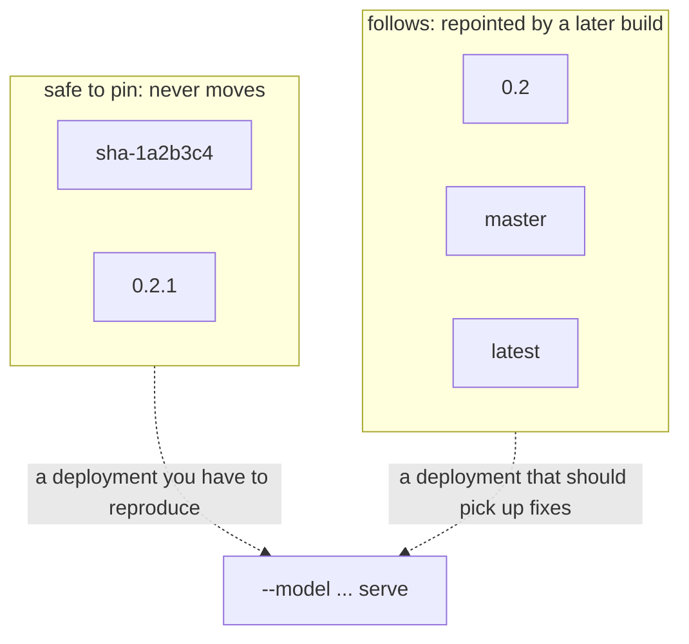
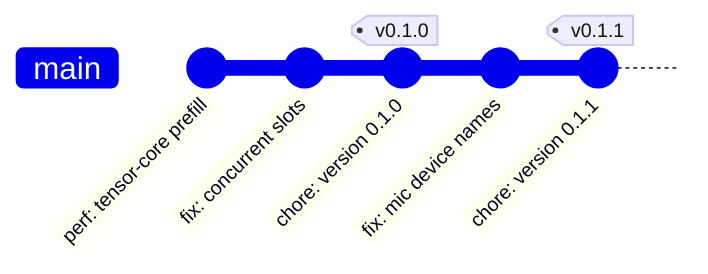

# Versions and images

One number, in one place: `VV_VERSION_STRING` in
[`include/vibevoice/vibevoice.h`](../include/vibevoice/vibevoice.h). CMake
reads it out of the header, so `project()` cannot drift from it, and CI
refuses to publish a `v*` tag that disagrees with it.

Everything else is derived.

## What each tag means

Published to `ghcr.io/ar4ikov/vibevoice.c`:

| tag | published on | moves |
|---|---|---|
| `0.2.1` | `v0.2.1` | never |
| `0.2` | `v0.2.1` | to the newest patch of 0.2 |
| `latest` | a release, or a push to master | to the newest build of either |
| `master` | a push to master | with the branch |
| `sha-1a2b3c4` | any push | never |
| `pr-7` | a pull request | built and tested, never pushed |

A bare major tag (`0`) is deliberately absent. Below 1.0 a minor bump is
allowed to break, so a tag that swallowed all of 0.x would be a trap; it
starts being published at `v1.0.0`.



For a deployment that must be reproducible, pin the digest rather than any
tag: `ghcr.io/ar4ikov/vibevoice.c@sha256:...`. A digest is the only
reference that cannot be repointed at all.

## Cutting a release



1. Bump `VV_VERSION_STRING` in `include/vibevoice/vibevoice.h`, and move the
   `CHANGELOG.md` entry from Unreleased into a section for that version.
2. Commit, then tag the commit: `git tag v0.1.0 && git push origin v0.1.0`.
3. The Container workflow checks the tag against the header, builds, runs
   `ctest` inside the build stage, publishes, then starts the published
   image with `--version` and fails if it does not name its own tag.

The first publication of a package on GHCR is private. Make it public in the
repository's package settings once, or configure authenticated pulls.

## What is running

The tag is stamped into the image as `VV_BUILD_REF`, so the binary can be
asked rather than trusted:

```bash
docker run --rm ghcr.io/ar4ikov/vibevoice.c:0.1.0 --version
# vibevoice.c 0.1.0 (0.1.0) [cuda openmp]
```

The release version, then what the build knew about its source, then the
features compiled in. A local build reports its `git describe` instead
(`0.1.0 (484a527-dirty)`), which is resolved when CMake configures — so
reconfigure before trusting it after a commit.

The same two strings come back over HTTP:

```bash
curl -s localhost:8080/health
# {"status":"ok","model":"vibevoice-asr","version":"0.1.0","build":"0.1.0",...}

curl -s localhost:8080/metrics | grep build_info
# vibevoice_build_info{version="0.1.0",build="0.1.0",features="cuda openmp"} 1
```

and the image carries them as OCI labels, which is what a registry UI and
`docker inspect` read:

```bash
docker inspect --format '{{json .Config.Labels}}' ghcr.io/ar4ikov/vibevoice.c:0.1.0
```

## GPUStack

[`deploy/gpustack/vibevoice.yaml`](../deploy/gpustack/vibevoice.yaml) lists
one `version_configs` entry per tag a deployment can be pinned to: `latest`,
the current release line, and `master`. Add the new line when a minor
version is first tagged; patch releases need no change, because `0.1` moves
on its own.
