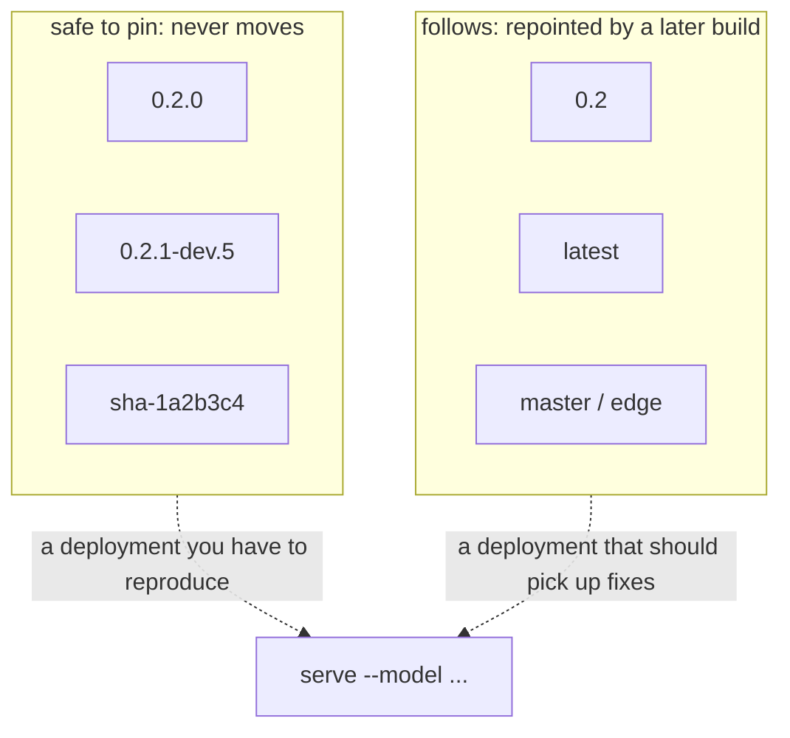
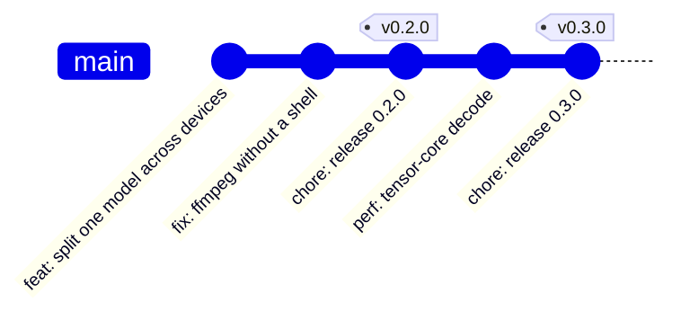

# Versions and images

TurboQwen follows [SemVer 2.0](https://semver.org). Below 1.0 a minor bump
is allowed to break and a patch is not; from 1.0 on, only a major bump may
break.

One number is written down, in one place: `VV_VERSION_STRING` (with
`VV_VERSION_MAJOR/MINOR/PATCH`) in
[`include/vibevoice/vibevoice.h`](../include/vibevoice/vibevoice.h). Every
build derives its full version from it and from git, by one rule in
[`cmake/Version.cmake`](../cmake/Version.cmake) that local builds, CI and the
image all run:

| the build is | it calls itself |
|---|---|
| exactly the `v0.2.0` tag, clean | `0.2.0` |
| 5 commits past `v0.2.0` | `0.2.1-dev.5+g1a2b3c4` |
| past `v0.2.0`, header already bumped to `0.3.0` | `0.3.0-dev.5+g1a2b3c4` |
| 5 commits past `v0.3.0-rc.1` | `0.3.0-rc.1.dev.5+g1a2b3c4` |
| any of the above with uncommitted changes | `…+g1a2b3c4.dirty` |
| no git at all (a tarball) | `0.2.0` |

A dev build is a prerelease of the *next* version, so SemVer precedence puts
it after the release it came from and before the one it is heading for. The
number after `dev.` counts commits since the tag, which on master only grows,
so every master build has a version of its own.

```bash
cmake -P cmake/Version.cmake
# version=0.2.1-dev.5+g1a2b3c4
# release=0.2.0
# revision=1a2b3c4
# image=0.2.1-dev.5
# prerelease=true
```

## What each image tag means

Published to `ghcr.io/ar4ikov/turboqwen`, and the same digest to
`ghcr.io/ar4ikov/turboqwen-vllm` and the old `ghcr.io/ar4ikov/vibevoice.c`.
Every pushed build carries one
SemVer tag that never moves — pin that one — plus the moving tags that apply:

| tag | published by | moves |
|---|---|---|
| `0.2.0` | the `v0.2.0` release | never |
| `0.2.1-dev.5` | a push to master | never |
| `sha-1a2b3c4` | any push | never |
| `0.2` | the newest `0.2.x` release | to the next patch |
| `1` | the newest `1.x` release, from 1.0 on | to the next minor or patch |
| `latest` | the newest release | to the next release — never a dev build |
| `master`, `edge` | a push to master | with the branch |
| `pr-7` | a pull request | built and checked, never pushed |

A bare `0` is deliberately absent: below 1.0 a minor bump may break, so a tag
that swallowed all of 0.x would be a trap. Moving tags are only given to the
newest release in their range, so patching an older line never drags
`latest` backwards.



For a deployment that must be reproducible to the byte, pin the digest:
`ghcr.io/ar4ikov/turboqwen@sha256:...`. A digest cannot be repointed at all.

## Cutting a release

Actions → **Release** → Run workflow, or from a terminal:

```bash
gh workflow run release.yml                       # next version from the commits
gh workflow run release.yml -f bump=minor         # or patch / major
gh workflow run release.yml -f version=1.0.0-rc.1 # exactly this
```

`auto` reads the [Conventional Commits](https://www.conventionalcommits.org)
since the last tag: a `type!:` subject or a `BREAKING CHANGE:` footer is a
major bump (a minor one below 1.0), any `feat:` is minor, anything else a
patch. If the header was already bumped past the last tag by hand, that
version wins.



What the workflow does ([`scripts/release.sh`](../scripts/release.sh), then
the Container workflow):

1. Picks the version and refuses one that is not newer than the last tag.
2. Writes it into the header, turns `## Unreleased` in `CHANGELOG.md` into
   the release's section (the commit subjects stand in if nobody wrote one),
   and adds a `version_configs` entry to the GPUStack manifest the first time
   a `X.Y` line is released.
3. Commits `chore: release X.Y.Z` to master and tags `vX.Y.Z`, checks the tag
   against `cmake/Version.cmake`, and pushes both atomically.
4. Builds the image, runs `ctest` inside the build, publishes the tags
   above, starts the published image and fails unless `--version` names
   exactly the release — before anything is announced.
5. Creates the GitHub release with the changelog section as notes, and
   attaches `turboqwen-X.Y.Z-linux-x86_64.tar.gz` (the binary from the
   image, with the licences) and its SHA-256.

`scripts/release.sh --dry-run auto` prints what would happen without
changing anything. Pushing a `v*` tag by hand still works: the Container
workflow checks it against the header, publishes it, and creates the GitHub
release if there is none.

Each change writes its own entry under `## Unreleased` in the pull request
that makes it; that text is what the release notes will say.

## What is running

The version is compiled into the binary, so it can be asked rather than
trusted:

```bash
docker run --rm ghcr.io/ar4ikov/turboqwen:0.2.0 --version
# TurboQwen 0.2.0 (1a2b3c4) [cuda openmp]
```

The version, the commit it was built from, and the features compiled in. The
container build has no `.git`, so CI passes both in; a local build asks git
on every build, so a new commit shows up without re-running `cmake`.

The same two strings come back over HTTP:

```bash
curl -s localhost:8080/health
# {"status":"ok","model":"vibevoice-asr","version":"0.2.0","build":"1a2b3c4",...}

curl -s localhost:8080/metrics | grep build_info
# vibevoice_build_info{version="0.2.0",build="1a2b3c4",features="cuda openmp"} 1
```

and the image carries them as OCI labels, which is what a registry UI and
`docker inspect` read:

```bash
docker inspect --format '{{json .Config.Labels}}' ghcr.io/ar4ikov/turboqwen:0.2.0
```

## GPUStack

[`deploy/gpustack/vibevoice.yaml`](../deploy/gpustack/vibevoice.yaml) lists
one `version_configs` entry per tag a deployment can be pinned to: `latest`,
each release line (`0.2`, …) and `master`. The Release workflow adds the line
the first time it is released; patches need no change, because `0.2` moves
on its own.
